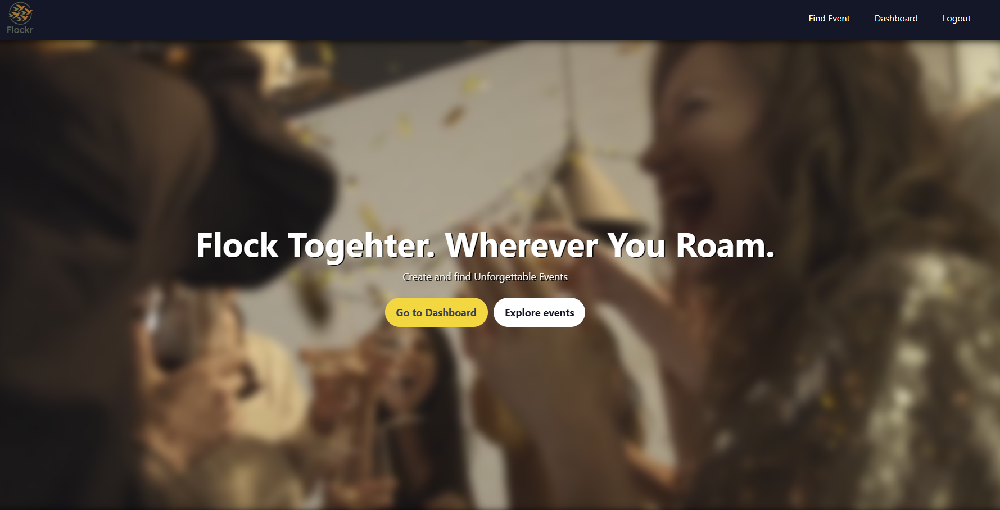
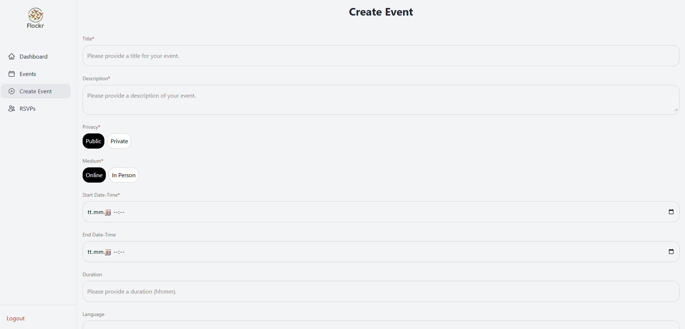
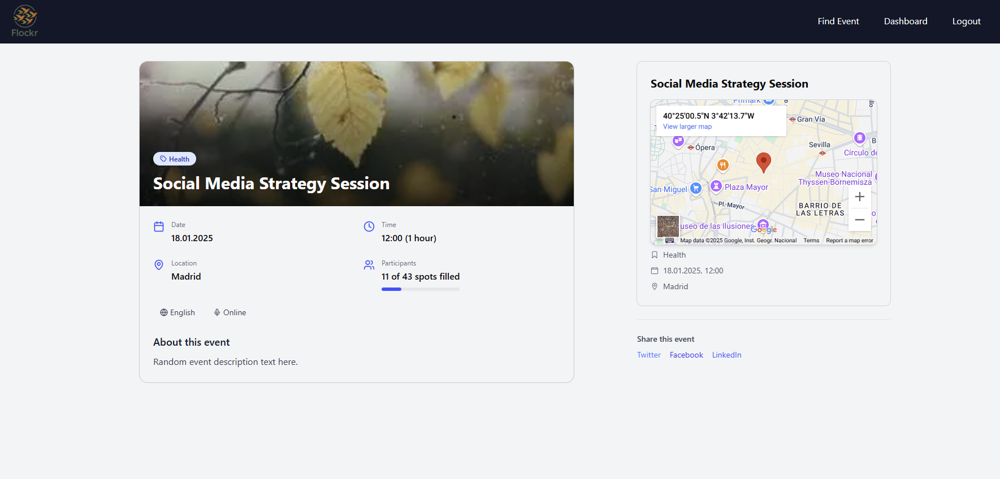
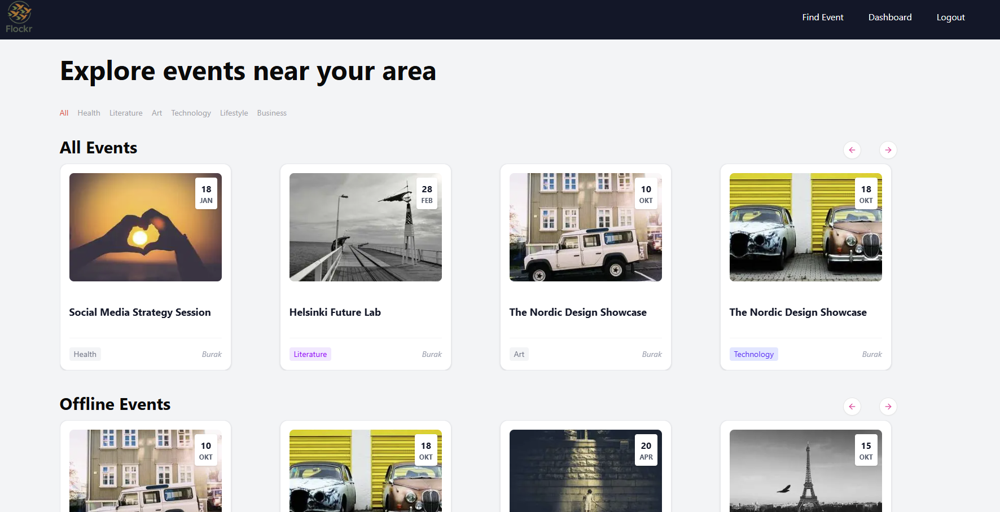
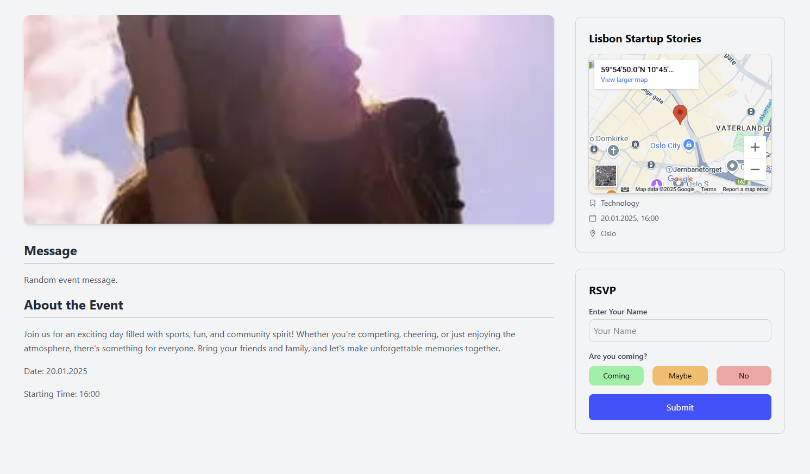

# Event Explorer

A web application built with **Next.js** and **MongoDB** that allows users to explore events, filter them by categories (such as Music, Sports, Technology, etc.), and view event details. The app is responsive, following a clean design. It also features a carousel for displaying events and their categories.

## Screenshots

Here are some screenshots of the app in action:








## Features

- **Event Display**: Shows a list of events with images, titles, categories, and start dates.
- **Category Filters**: Filter events by category (e.g., Music, Sports, Technology, etc.).
- **Responsive Design**: Fully responsive layout for desktop and mobile views.
- **Online and Offline Events**: Separate filters and displays for online and offline events.
- **Event Details**: Click on an event to view more details.

## Tech Stack

- **Frontend**: React, Next.js, Tailwind CSS
- **Backend**: MongoDB (for event storage)
- **Authentication**: Context API for user authentication status
- **Date Formatting**: `date-fns` for date manipulation
- **Carousel Component**: Custom carousel implementation for event listing

## Setup

### Prerequisites

Make sure you have the following installed:

- [Node.js](https://nodejs.org/)
- [MongoDB](https://www.mongodb.com/try/download/community) (or a MongoDB cloud instance)

### 1. Clone the Repository

```bash
git clone https://github.com/BuraYu/rsvp.git
cd my-app
```

### 2. Install Dependencies

Run the following command to install the required dependencies:

```bash
npm install
```

### 3. Configure Environment Variables

Create a `.env.local` file in the root directory and add the following environment variables:

```env
MONGODB_URI=your_mongo_db_connection_string
NEXT_PUBLIC_API_URL=your_api_url
NEXT_PUBLIC_SITE_URL=your_url
```

Replace `your_mongo_db_connection_string` with the connection string to your MongoDB instance, and `your_api_url` with the base URL for your API.

### 4. Run the Application

Start the development server:

```bash
npm run dev
```

Now, you can visit `http://localhost:3000` in your browser to see the application running.

## Directory Structure

```
/app
  /api
    /auth           - Authentication-related logic
    /createEvent    - Event creation logic
    /events         - Logic for managing events
    /rsvp           - Homepage displaying events
  /dashboard
    page.js         - Dashboard landing page for user management
    /createEvent    - Event creation functionality in dashboard
    /events         - Events list or management within the dashboard
    /rsvp           - RSVP management within the dashboard
  /events
    [eventId].js    - Dynamic event details page for viewing specific events
  /login
    page.js         - Login page
  /rsvp
    [rsvpId].js     - RSVP confirmation page for specific event RSVP
  /signup
    page.js         - Signup page
  layout.js         - Main layout for the app
  page.js           - Main entry point for the app
/components
  EventInfo.js      - Component to display event information
  Hero.js           - Hero section component
  Navbar.js         - Navbar Component
  Sidebar.js        - Sidebar Component
```

## How It Works

1. **Event Fetching**: The events are fetched from an API (`/api/events`), and the results are filtered based on the category and event type (online or offline).
2. **Event Filtering**: Users can filter events by category (e.g., Music, Sports) and view them in a carousel format.
3. **Responsive Design**: The layout adjusts to different screen sizes using Tailwind CSS, ensuring a smooth user experience on both desktop and mobile.

## Contributing

We welcome contributions! If you'd like to contribute, please follow these steps:

1. Fork the repository.
2. Create a new branch (`git checkout -b feature-branch`).
3. Make your changes and commit them (`git commit -am 'Add new feature'`).
4. Push to your branch (`git push origin feature-branch`).
5. Create a pull request.

## License

This project is licensed under the MIT License - see the [LICENSE](LICENSE) file for details.

## Acknowledgements

- [Next.js](https://nextjs.org/)
- [MongoDB](https://www.mongodb.com/)
- [Tailwind CSS](https://tailwindcss.com/)
